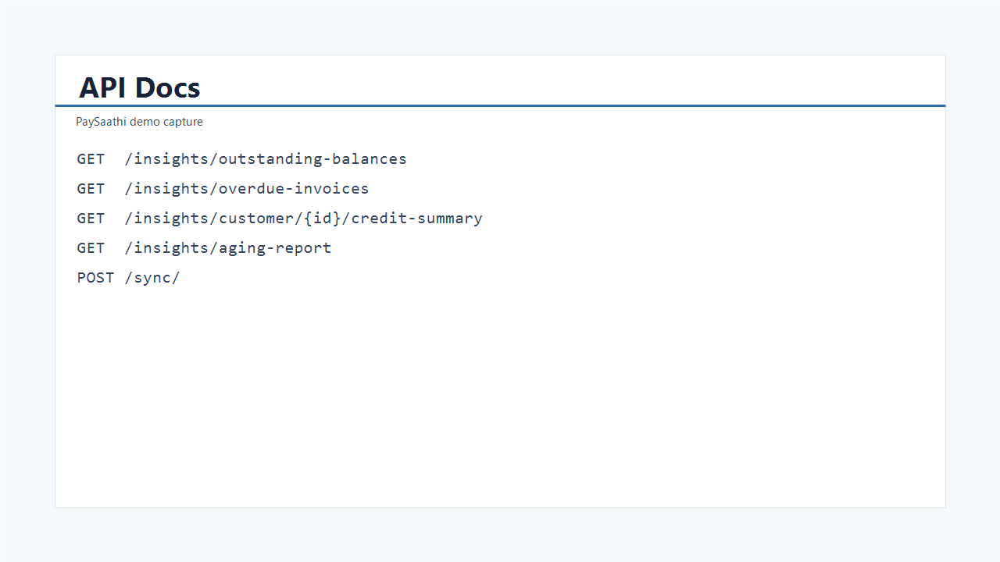
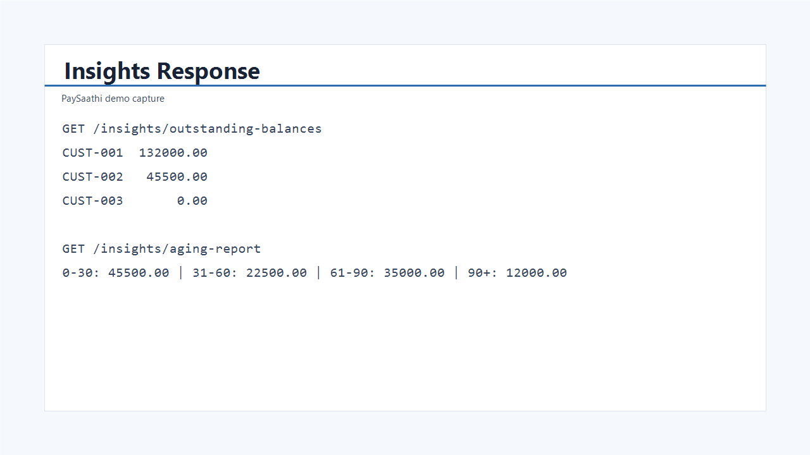

# PaySaathi

Integration service for syncing accounting data and exposing receivable insights.

## GitHub Repository

https://github.com/punyamodi/Assignment-PS

## Time Expectation

Most candidates spend 36 to 48 hours on this task.
I focused on showing clear system thinking and integration decisions instead of trying to build a perfect product.

## How to Run

Prerequisites:
- Python 3.11+
- pip

Install dependencies:

```bash
pip install -r requirements.txt
```

Start mock external API (terminal 1):

```bash
uvicorn app.external.mock_api:app --port 8001
```

Start main service (terminal 2):

```bash
uvicorn app.main:app --port 8000 --reload
```

Trigger sync:

```bash
curl -X POST http://localhost:8000/sync/
```

Run tests:

```bash
python -m pytest tests/ -v
```

API docs:
- http://localhost:8000/docs

## Key Design Decisions

1. FastAPI for fast API development and built in docs.
2. SQLite with SQLAlchemy for simple local setup.
3. Idempotent sync with update or insert logic.
4. Separate mock API to simulate external integration.
5. Service layers to keep route handlers thin.

## System and Integration Logic

I designed this as two services.
The mock accounting API acts like an external dependency.
The main service pulls customers, invoices, and payments from that external source and stores them in local tables.

I kept sync idempotent so repeated sync calls do not duplicate records.
I sync in a fixed order.
Customers first, then invoices, then payments.
This keeps data relationships valid.

After data is synced, all insight endpoints read from local storage.
This avoids repeated external calls and keeps insight responses stable and fast.

## Assumptions

1. External API returns full datasets.
2. One currency is used across all records.
3. Payments are linked to invoices.
4. Sync is manually triggered with `/sync/`.
5. Outstanding amount is `invoiced - paid`.

## Screenshots

Add screenshots under `docs/screenshots/` using these names:

- `api-docs.png`
- `sync-response.png`
- `insights-response.png`

Example markdown after adding files:

```md



```
